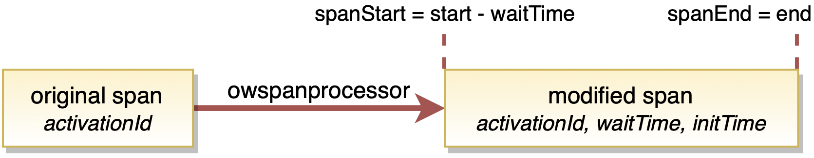
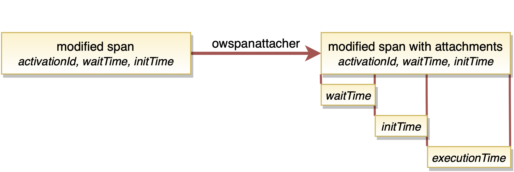
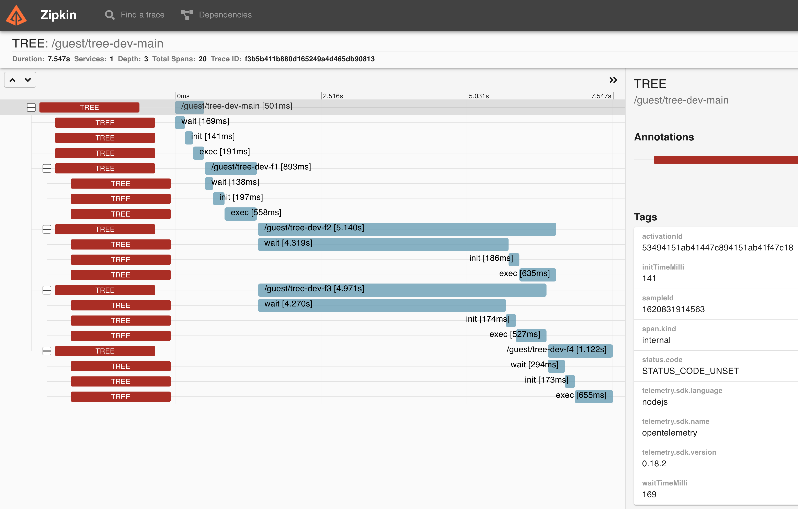

# OpenWhisk Trace Collector

The OpenWhisk Trace Collector is a microservice based on the [OpenTelemetry Collector Library](https://github.com/open-telemetry/opentelemetry-collector) to post-process FaaS-function invocation spans in [TppFaaS](TODO). For this, the service receives spans generated by the [OpenTelemetry Library](https://opentelemetry.io/docs/js/instrumentation/#creating-spans), which instruments the FaaS-functions. Each span represents a function invocation and is marked with a unique *activationId* generated by OpenWhisk, which associates the span with its respective invocation. The Collector uses the Id to retrieve meta-information about the span's invocation from the OpenWhisk API. The meta-information includes:

* Timestamps recording the start and end of the invocation
* The function initialization time ([*initTime*](https://github.com/apache/openwhisk/blob/master/docs/annotations.md#annotations-specific-to-activations) in OpenWhisk terminology) in case of a cold start
* The [*waitTime*](https://github.com/apache/openwhisk/blob/master/docs/annotations.md#annotations-specific-to-activations) capturing the delay of the invocation in the internal OpenWhisk system

Inside the Collector the span traverses a pipeline including the two configurable processors *owspanprocessor* and *owspanattacher* which transform the span using the retrieved meta-information:

* __owspanprocessor__ receives spans in the OpenTelemetry data format. Each span represents a function invocation and must contain the respective activationId as an attribute. The processor retrieves the invocation's meta-information from the OpenWhisk API, which contains the waitTime and initTime. Both values are added to the span as attributes. Furthermore, the start and end time of the span is adjusted to conform with the retrieved information.



* __owspanattacher__ is optional and must be located in the pipeline after the owspanprocessor as it extracts the waitTime and initTime attributes from the span to create corresponding child spans. The processor generates a child span for the code execution, the waitTime, and the initTime.



In the pipeline's last step, the span is exported to [Zipkin](https://zipkin.io/). Here, the span is aggregated to a trace with other spans of the FaaS-application. One example of such a trace representing an execution of a tree-shaped FaaS-application is depicted below:



## Configuration and Deployment

Configure the processors and the exporter in `k8s/config.yaml`, a k8s manifest for deploying the Collector in your cluster.

```yaml
...
processors:
    ...
    owspanprocessor:
        ow_host: http://owdev-nginx.openwhisk.svc.cluster.local:80
        ow_auth_token: 23bc46b1-71f6-4ed5-8c54-816aa4f8c502:123zO3xZCLrMN6v2BKK1dXYFpXlPkccOFqm12CdAsMgRU4VrNZ9lyGVCGuMDGIwP
        logging: true
    owspanattacher:
        logging: true
exporters:
    zipkin:
        endpoint: "http://zipkinot.default.svc.cluster.local:9411/api/v2/spans"
...
```

## Build a Docker Image of the Collector

```bash
docker build -t koelschkellerkind/owtracecollector:tag .
```

## Releases

* 1.0.0 initial release
* 1.0.1 refactoring: owtracecollector is separated in owspanprocessor and owspanattacher (24th March 2021)
* 1.0.2 changed unit of wait and initTime attributes to milliseconds (29th March 2021)
* 1.0.3 renamed child spans of attacher (31st March 2021)
* 1.0.4 bugfix: `start` from OpenWhisk activation record represents beginning of initialization (7th April 2021)

---

## Build a Collector Executable via Opentelemetry-Collector-Builder (DEPRECATED)

Opentelemetry-collector-builder can be used to build a executable of the collector.

1. Clone <https://github.com/koelschkellerkind/opentelemetry-collector-builder>
2. Create the binary of the builder with

    ```go
    go build
    ```

3. Add the binary to your your PATH

4. Create the binary of the collector with

    ```bash
    opentelemetry-collector-builder --config builder.yaml
    ```

5. Then

    ```bash
    cd owtracecollector-dist
    ```

6. Start the collector with

    ```bash
    ./owtracecollector --config ../otel-collector-config.yaml  
    ```

### Pitfalls

Using tabs in the `builder.yaml` results in an error
